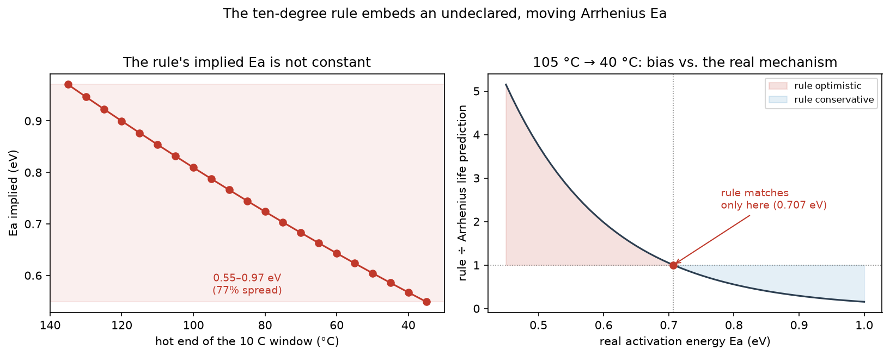

# The ten-degree rule is an undeclared Arrhenius model

The electrolytic-capacitor industry's standard life-derating shortcut — life doubles for every
10 °C the operating temperature drops below rated, halves for every 10 °C it rises — is usually
presented as a mechanism-free rule of thumb, independent of activation energy. **It is not.**
Solving the rule for the activation energy it implies shows the rule *is* an Arrhenius model,
with an `Ea` that changes depending on which temperature window and which extrapolation span you
apply it to — and the direction of the resulting error is predictable and, at typical
electrolytic-capacitor activation energies, dangerous rather than conservative.

> **Status: derivation proven, closed-form, reproducible with the standard library — and the
> deviation it predicts is confirmed independently by two manufacturers' own technical notes.**
> See [§4](#4-confirmed-independently-by-two-manufacturers-own-technical-notes) and
> [`references.md`](references.md). A published numeric `Ea` to compare directly against the
> 0.707 eV this repository derives is not found yet — see [Open](#open).

## TL;DR

- Solved the rule's own definition backwards for the Arrhenius activation energy `Ea` it implies.
- That `Ea` is **not constant — it varies 77%** depending on where on the temperature scale the
  rule is applied (0.549–0.971 eV across a sliding 10 °C window).
- At a realistic extrapolation (105 °C rated → 40 °C use), a plausible real `Ea` for
  electrolyte-evaporation wear-out (~0.5 eV) makes the rule **overstate life by up to 3.75×** —
  optimistic, not conservative.
- **Two competing manufacturers (Rubycon, Nichicon) independently confirm the deviation** in
  their own technical notes, without quantifying it — see [`references.md`](references.md).
- Fully reproducible: standard-library-only `verify.py`, 14 automated tests, every citation
  traceable to a page number.



## ▶ Reproduce it

```bash
python3 verify.py     # standard library only, no dependencies
```

Every number below comes straight from the rule's own definition and Arrhenius' equation — there
is no proprietary or measured data in this repository; everything is derivable from public,
textbook physics.

## The rule

```
L(T_use) = L_rated * 2 ** ((T_rated - T_use) / 10)
```

Manufacturers publish rated life at a rated ambient temperature (commonly 105 °C, sometimes
85 °C), and the 10-degree rule extrapolates it down to the actual operating temperature.

## 1. The rule embeds an activation energy

Any Arrhenius acceleration factor between two temperatures can be written

```
AF = exp[ Ea/k * (1/T_cold - 1/T_hot) ]
```

Setting `AF = 2` (the rule's own definition for a 10 °C step) and solving for `Ea` gives the
activation energy the rule assumes **in that window**:

| window (°C) | Ea implied (eV) |
|---|---|
| 135 → 125 | 0.971 |
| 105 → 95 | 0.832 |
| 85 → 75 | 0.745 |
| 65 → 55 | 0.663 |
| 45 → 35 | 0.586 |
| 35 → 25 | 0.549 |

**Range: 0.549–0.971 eV — a 77% spread**, purely from where on the temperature scale the 10 °C
step is taken. A rule advertised as mechanism-free is quietly assuming a different failure
mechanism at every point on the curve.

## 2. The Ea it embeds also depends on how far you extrapolate

Manufacturers apply the rule over one big jump — rated temperature to actual use temperature —
not a single 10 °C step. That changes the implied `Ea` again:

| from 105 °C to | Ea implied (eV) |
|---|---|
| 85 °C | 0.809 |
| 65 °C | 0.764 |
| 55 °C | 0.741 |
| 45 °C | 0.719 |
| **40 °C** | **0.707** |
| 25 °C | 0.673 |

The wider the extrapolation, the lower the implied `Ea` — the rule gets *less* conservative,
not more, the further you push it past its calibration point.

## 3. The direction of the error, at a realistic use temperature

Fix a datasheet-typical scenario: 5,000 h rated at 105 °C, used at 40 °C. Compare what the rule
predicts against what a true Arrhenius model predicts, at several `Ea` values plausible for
electrolyte evaporation and related wear-out mechanisms:

| Ea real (eV) | rule predicts (h) | Arrhenius predicts (h) | rule / Arrhenius | verdict |
|---|---|---|---|---|
| 0.50 | 452,548 | 120,823 | **3.75×** | optimistic — dangerous |
| 0.60 | 452,548 | 228,446 | **1.98×** | optimistic |
| 0.707 | 452,548 | 451,632 | 1.00× | coincides (by construction) |
| 0.80 | 452,548 | 816,687 | 0.55× | conservative |
| 0.90 | 452,548 | 1,544,157 | 0.29× | conservative |
| 1.00 | 452,548 | 2,919,626 | 0.16× | conservative |

**The rule only matches reality at exactly the `Ea` it happens to embed for that span (0.707 eV
here). Below that, it overstates life — in the worst case shown, by nearly 4×.** Electrolyte
evaporation and related low-barrier wear-out mechanisms are commonly cited in the 0.4–0.7 eV
range, which puts a real design on the optimistic side of this table more often than the rule's
universal-shortcut reputation suggests.

## Why this matters

This is exactly Pitfall 2 of accelerated-life-test practice: *asking for "the activation energy"
already assumes a damage mechanism, and the acceleration factor is strongly sensitive to it.*
The ten-degree rule does not avoid that assumption — it makes it silently, and the assumption
changes depending on where and how far you apply the rule. A design margin computed with the
rule is a margin computed against an unstated, moving `Ea`.

## 4. Confirmed independently by two manufacturers' own technical notes

**Rubycon Corporation** (doc. 3925-1e, §5-1) states the rule as `L = L0 * 2^((Tmax-Ta)/10)`,
presents it alongside a true Arrhenius curve (both anchored at 1.0 at 105 °C), and then states
directly:

> "The Arrhenius law and the '10°C 2 times law' show good consistency in the range of 70°C to
> 90°C, but there is some deviation of '10°C 2 times law' in the temperature range less than
> 60°C or more than 105°C."

**Nichicon Corporation** (CAT.8101H, §2-9-3) names the same rule "Arrhenius theory" and states
its applicability floor directly:

> "In general, if a capacitor is used at the maximum operating temperature or to a minimum of
> 40°C operating temperature the life expectancy can be calculated according to Arrhenius
> theory in which the life doubles for each 10°C drop in temperature."

Two different manufacturers, two different documents, the same shape of caveat: the rule holds
in a bounded window and both name where that window ends. **Nichicon's stated floor, 40 °C, is
exactly the use temperature in §3's worked example** — the manufacturer's own applicability
limit sits at the edge of a routine extrapolation, not far past it.

That is two manufacturers confirming, in their own reference documents, *that* the rule
deviates from Arrhenius outside a bounded window and roughly *where* — independent of anything
computed here. What this repository adds is *how much*: the deviation is not incidental drift,
it is the direct, closed-form consequence of the rule embedding a moving `Ea` (§1–§2), and at a
realistic extrapolation the resulting bias is directional and large (§3), not a rounding error.
Full citations and quotes-in-context in [`references.md`](references.md).

## Open

**Not resolved:** neither manufacturer publishes a numeric `Ea` in eV to compare directly
against the 0.707 eV this repository derives at the common 105 °C → 40 °C span — both confirm
the rule's bounded validity in words and figures, not in a parameter. Panasonic's lifetime-tool
manual was also checked and has no `Ea` or formula at all. A long-life premium-series datasheet,
rather than these general technical notes, is the next place to look if the exact number is
still wanted. See [`references.md`](references.md) for the full trail of what was checked.

## Method note

All numbers here follow directly from the Arrhenius equation and the rule's own definition —
there is no fitting, no measured dataset, and no proprietary source. `verify.py` recomputes
every table in this README from first principles; running it also writes the three tables to
`data/` as CSV. `tests/` covers every headline number with pytest — `python3 -m pytest tests/ -v`.

The figure above is generated by `plot.py`, kept separate on purpose: `verify.py` stays
standard-library-only, and only `plot.py` needs matplotlib. Regenerate it with
`pip install matplotlib && python3 plot.py`.

Related public work: [`weibayes-zero-failures`](https://github.com/marcospaula/weibayes-zero-failures)
(same audit method, applied to a different shortcut) and
[`relengy`](https://github.com/marcospaula/relengy) (the reliability library this analysis reuses
the Arrhenius/AF conventions from — see `src/relengy/quantitative/alt.py`).
